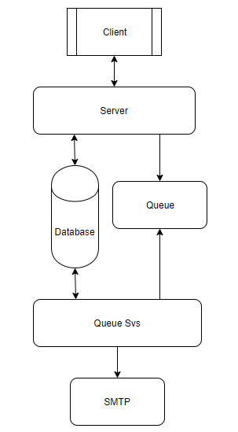
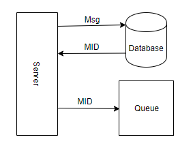
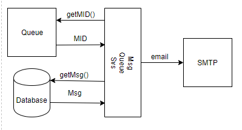

## Architechure Requirements
This document lists the components that our team feels that the project requires from an Architectural Standpoint. It contains mostly object classes that will be used in our database to ensure that a User can manage the Contacts that he/she wants to have in a group. An important note for reading this document, a "User" would be someone that has created an account on our site and is using our product, a "Contact" is someone that the User has created and added to a group to send messages to. 

### Person Object
This object is a superset of fields necessary to represent both users and contacts. It will used to represent user accounts that sign up for Carrier Pigeon and all contacts that a user creates. This object will mainly be used for storing the data of each contact and each user. A user can edit a Contact's Person object through the Edit Groups page.
- firstName – string
- lastName – string
- emailAddress – string
- verifyCode – int
- verifyCodeExp – date
- password – String (Hash to Store)
- phoneNumber – (Optional) string
- carrierID – int
- isUser – boolean
- uniqueId – int
- ownerId – int 

### Group Object
This object contains all fields necassary to represent groups created by all users. They will be sorted by a group owner, which references a User's uniqueID. Each group will also be named, given a unique groupID, and a list of all Persons in that group. This Component will mainly be accessed on the Edit Groups page, as well as when a message is sent.
- groupId – int
- groupName – string
- groupOwner (Person.uniqueId) – int
- members ([ ] Persons.uniqueId) – int

### Carrier Object
This is a small component, but necessary for sending SMS messages to phone numbers. This class will take a Carrier name and convert it to a proper email address domain. This component will be used strictly when assigning a phone number an "email address".
- Email address – string
- Name – string
- carrierId – int

### MessageHeader Object
This will be used to store message templates for a user to select at a future time. Using a user defined template name, the user may select a template which will pull a message based on the messageID, GroupID, and senderID.
- templateName – string (if populated, shows up in template dropdown)
- messageId – int
- groupId – int
- senderId – int
- lastSent – date

### MessageBody Object
This is the object that actually stores the message. Using two strings for storage, one for the subject and one for the body, the database will use the messageID as a unique identifier. 
- subject – string
- content – string
- messageId – string (same as message in header)

### Message Object
This object is used for assembling a complete smtp message for generating smtp requests.
- from – string
- to – string[ ]
- subject – string
- body – string

### MessageQueue Object
This is an important component if a group has a large number of contacts to send a message to, or if 2 users want to send messages at the same time. Using the messageID, a message to be sent will be added to the queue in chronological order to be sent.
- messageId – string

### ContactList Object
This object contains a list of contacts. This list will be editable by the User from the Edit Groups page. it is a list of Person objects that all share a specific groupID.
- List ([ ] Person)

### Functions
- signin – This function will validate user by comparing password hash with password has stored in backend database based on uniqueId.
- createPerson – This function will create a Person Object and insert the data into the backend database. This function will be used for both user and contact creation. The uniqueId (primary key) field on the Person object will be generated at insert.
- updatePerson – This function will facilitate updating a Person Object and persisting the changes to the backend database. This function will return the updated Person Object.
- setPassword – Will hash user supplied password and store resulting hash in password field of backend database referncing Person Object.
- generateValidationCode – Will create a one time 4 digit code that will be saved in the backend database referencing Person Object along with an expiration DateTime. This function will also email the 4 digit code to the email specified in the referenced Person Object to facilitate the completion of the signup process.
- verifyUserCode – This function will compare the user supplied 4 digit code with the copy stored in the database for the referenced Person Object 
- getGroups – This function uses the uniqueId of the referenced Person object to retrieve a list of groups owned (groupOwner) by the referenced user.
- createGroup – This function will facilitate the creation of Group objects and persisting them to the backend database.
- updateGroup – This function will facilitate the updating of Group Objects and persisting the changes to the backend database.
- getContacts – This function uses the groupId to retrieve the list of Person Objects associated with the referenced Group.
- getAllContacts – This function uses the uniqueId of the referenced Person object to retrieve a full list of all contacts owned (ownerId) by the user.
- getCarriers – This function will return a list of Carrier objects from the backend database to facilitate the assignement of a carrierId to a Person Object allowing the system to email an SMS message and to poplulate the carrier drop down list in the UI.
- getMessage – This function builds a complete email message from the backend database using the messageId. This function is used to display a saved template as well as by the MessageQueue component for sending emails.
- getMessageHeader – This function retrieves a MessageHeader Object from the backend database using the messageId. This function is used by the by getMessage in the assembly of outgoing smtp requests and the template list drop down in the UI.
- getMessageBody – This function retrieves a MessageBody Object from the backend database using the messageId. This function is used by getMessage in the assembly of outgoing smtp requests and to display a selected message template in the UI.
- saveMessage – This function saves the user supplied MessageHeader and MessageBody to the backend database linking both parts with the messageId (message lookup table primary key). This function returns the messageId.
- sendMessage – This function places the supplied messageId to the MessageQueue and notify the user that the message has been scheduled to be sent and they receive a summary via email once the message has been completely processed.
- setLastSent – This function will update the lastSent field in the backend database for the supplied messageId (MessageHeader Object.)

### Components
#### MessageQueueService
This component is responsible for assembling queued messages from the backend database identified by the messageId that has been placed in the queue.  The component is a backend process that will run (wake) periodically to process messages in the memory resident queue. Once the message is assembled the component will resolve the groupId(s) and generate the requisite smtp messages prompting the smtp server to send the messages. Once the smtp messages have been generated and passed to the smtp server, the MessageQueueService will remove the message Id from the queue update the lastSent date in the messageHeader in the backend database, send a summary message to the message originator (Person.emailAddress referenced by MessageHeader.senderId) and begin processing the next queued message. 

