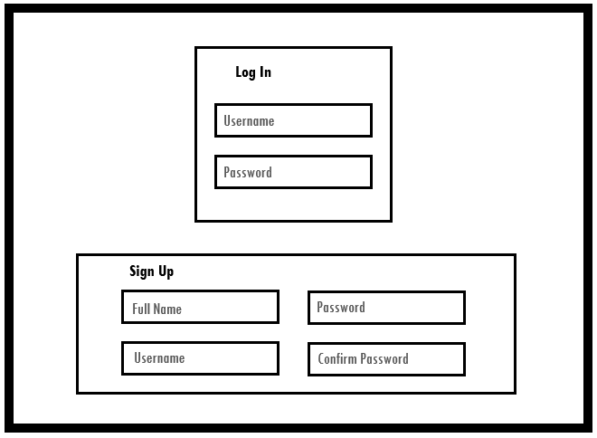
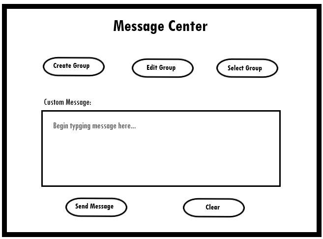
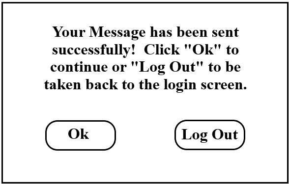

## **Team Trying to Graduate**
## User Requirements:

---
## **Problem:** 
Overextended small business owners are looking for a low-cost solution to the problem of quickly and efficiently deploying a group alert message containing information such as, office schedule changes, inclement weather, and other time sensitive notifications. Without easy access to employee contact information as well as the use of group messaging, precious time can be wasted, preventing urgent messages from reaching their target audience.

## **Solution:** 
Our team intends to solve this problem by developing an application that will allow users to sign up for an account and create staff groups within that account with whom they wish to communicate.  Our alert system application will use a website that prompts the user to either login, if they are existing customers, or sign up if they are new customers.  The permissions generated at this point will allow the users to build or gain access to their recipient groups to whom they plan on sending notifications.  The username field will require a valid email address to gain access.  This email will serve as our main method of communication and support for any account related issues.

Once the user is logged in, they will be redirected to the main page of the alert system application.  This page will be the user interface for all message alerts and group configuration. From this page the user can create new groups, add or remove data from existing groups, or choose which group(s) they would like to send a notification.  The interface will also allow the user to create a custom message or select from a list of pre-written messages commonly used in small businesses.  Once the message has been compiled and the group selected, the user can choose to submit the message or clear all selections and start over.     

It is important to note here that once the employee groups have been established, this application will serve as a one stop shop where busy small business owners and/or managers can go, to quickly send out a text or email alert without having to search employee records for phone numbers or create group emails that may not be accessible to all employees.  The application provides a way to quickly and efficiently send important communications without the time-consuming process of individual notifications.

After the message has been sent, the user will receive a pop-up confirmation window that lists two options.  The user can either select to “ok” to be redirected back to the main user interface, or “log out” which will take them back to the login page. 

---

## **If time permits, we would like to add the following user tools:**
### RSVP
### Import CSV contacts
### Custom signature/logo attached to all messages
### Two-way communication
### Alerts to specific individuals within a group
