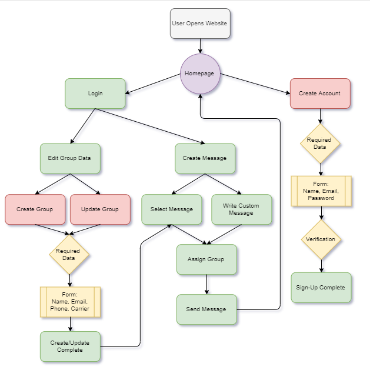

## **Requirements:** 
---

### **Overall:**
  - Must be accessible on all desktop web browsers
  -	Email addresses must be in a valid email format
  - Website Asethetics
	- All text font should be tentatively Arial Rounded MT Bold
	- Font size should vary between heading and comments: 24 and 14 pt
	- Background color will be green
	- Text will be white and black
	- Buttons will be green with darker shadow
	- Buttons will have rounded edges
### **Homepage/Sign in:**
  - Homepage will display the company name at top center.
  - "Sign-In" Button displayed below two text boxes for username and password.
  - "Sign-Up" Button displayed below five texboxes for name, email, phone, password, and confirm password. 
  - "Forgot Password" hyperlink below "Sign-In" button. 
### **Sign-Up:**
  -	Form: Name, Email Address, Phone, Password, Confirm Password
	- Required fields are Name, Email Address, Password, Confirm Password
	- Optional field: Phone number
  -	Sign-up button, runs verification method and takes user to their message dashboard.
### **Sign-In:** 
  - Form: Username (email address) and Password
	-All fields are required
  - Forgot Password hyperlink will be displayed below the password texbox
  	-Clicking this link will allow the user to enter a registered eamil address to receive the forgotten password.
### **Message Dashboard:**
  - On the message dashboard, "Welcome (user name)!" will be displayed in the top left corner.
  - In the top right corner will be an "Edit Groups" button that will allow the user to navigate to the Groups Page.
  - A large textbox will be displayed in the center of the screen where the user can type a custom message.
  - Above the top left corner of the message texbox will be a dropdown menu where the user can select a pre-written message
  	-These messages will contain common alerts that can be either,sent as is, or edited by the user before sending.
  - Above the top right corner of the message texbox is another dropdown menu where receipient group(s) can be selected from an ordered list.
  - Beneath the text box, in the bottom left corner of the page will be a button labled "Send". 
  	- This button will submit the written/chosen message to everyone in the selected group.
	- The message will be sent by way of text or email depending on the information stored in the group.
	- If at this point, a group has not been selected, a pop up will appear asking the user to select a recipiant.
  - Just below the text box, to the right will be a button labled "Cancel".
  	-clicking this button will clear all message contents and groups selected.
  - Once the message has been verified and sent, the user will be shown a pop up message confirming the message status
  	-the pop up window will display a button labled "Ok".
	-Clicking "Ok" on this window allows the user to return to the message dashboard. 
  - Parallel to the "Send" and "Cancel" buttons will be another button labled "Sign-Out".
  - This button routes the user back to the alert system homepage.
### **Groups Page:**
  - Displays a list of groups in alphabetical Order
  - One Group can be selected, allowing an edit button and a delete button to become clickable
  - Add Group button (Top left) goes to a blank Edit Group page.
### **Edit Group Page:**
  - Allows user to Edit (or create) group name within a text box in the top left.
  - Center of Screen is an Alphabetical list of Group members by last name
  - Clicking on a member shifts the list down
    	- Shows all member fields as editable text boxes: First name, Last Name, Email Address, Phone number
  -	Top right is a button that allows you to add a member
    -	Adding a member Creates a default Member: “Johnny Appleseed”
    -	Default Member can then be clicked on and edited.
  -	Save button is on the bottom right
  -	Exit button is next to save button
    -	If group was not saved before clicking exit, Prompt user to save, or exit without Saving.

