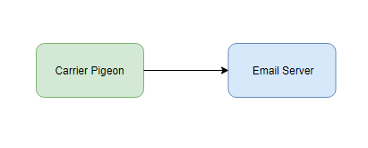
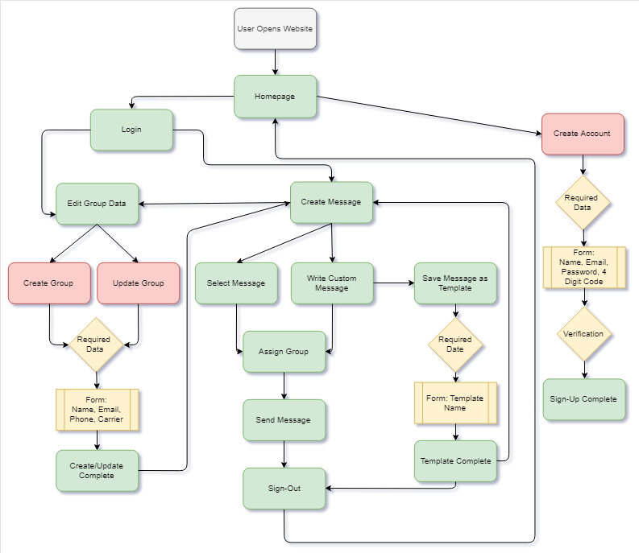

## **Context Model**
---

---
---
## **Requirements:** 
---

---
### **Overall:**
  - Must be accessible on all desktop HTML5 web browsers
  -	Email addresses must be in a valid email format
  - Website Asethetics
	- All text font should be tentatively Arial Rounded MT Bold
	- Font size should vary between heading and comments: 24 and 14 pt
	- Background color will be green
	- Text will be white and black
	- Buttons will be green with darker shadow
	- Buttons will have rounded edges
  - All required text entry fields should be validated for correct format.
### **Homepage/Sign in:**
  - Homepage will display the company name at top center.
  - "Sign-In" Button displayed below two text boxes for username and password.
  - "Sign-Up" Button displayed below six texboxes for name, email, phone, password, confirm password, and verification code
  	- email textbox has a "verify email" hyperlink next to it to send the verification email and complete sign up.
  - **Desirable:** 
  	- "Forgot Password" hyperlink below "Sign-In" button. 
### **Sign-Up:**
  - Form: Name, Email Address, Phone, Password, Confirm Password
	- Required fields are Name, Email Address, Password, Confirm Password
	- Optional field: Phone number
  - Sign-up requires verification method to complete.
  	- Provided email is parsed for proper format.
	- User clicks the "Get Code" hyperlink once email is entered.
	- Verification email with 4 digit code is sent to email provided.
	- User enters verification code in provided field.
  - "Sign-Up" Button is made available only after verification code is entered
  	- Once clicked, the user is routed to the Message Dashboard Page.
### **Sign-In:** 
  - Form: Username (email address) and Password
	- All fields are required
  - **Desirable:**
  	- Forgot Password hyperlink will be displayed below the password texbox
  		- Clicking this link will allow the user to enter the users registered email address to receive instructions for reseting the users password.
### **Message Dashboard:**
  - On the message dashboard, "Welcome (user name)!" will be displayed in the top left corner.
  - In the top right corner will be an "Edit Groups" button that will allow the user to navigate to the Groups Page.
  	- All group additions, updates, and deletions will happen here.
  - A large textbox will be displayed in the center of the screen where the user can type a custom message.
  - Above the top left corner of the message texbox will be a dropdown menu where the user can select a previously-written message
  	- These messages will contain common alerts and previously sent messages that can be edited by the user before sending.
	- The user can add templates to this list before navigating away from the dashboard to prevent loss of data.
	- Located next to the dropdown menu will be a "Save Message" option that will add a new message to the list.
		- The user will be prompted to name the message before saving.
  - Above the top right corner of the message texbox is another dropdown menu where recipient group(s) can be selected from an ordered list.
  - Beneath the text box, in the bottom left corner of the page will be a button labled "Send".
  	- Clicking this button will clear the Message Dashboard and submit the written/chosen message to everyone in the selected group.
	- The message will be sent by way of text or email depending on the information stored for each recipient.
	- If at this point, a group has not been selected, a pop up will appear asking the user to select a recipient group.
  - Just below the text box, to the right will be a button labled "Cancel".
  	- clicking this button will clear all message contents and change the selected group back to the first group in the ordered list.
  - Once the message has been verified and saved into user history, the user will be shown a pop up message stating they will receive a confirmation email when the message has been sent successfully.
  	- the pop up window will display a button labled "Ok".
	- Clicking "Ok" here allows the user to return to the message dashboard. 
  - Parallel to the "Send" and "Cancel" buttons will be another button labled "Sign-Out".
  	- This button routes the user back to the alert system homepage where they can close their browser or sign-in again.
### **Groups Page:**
  - Upon entering the Groups Page, the user will be presented with a list of their established groups in alphabetical order.
  - If no groups have been created, a message stating "You have no active groups." will be displayed.
  - A button labeled "Create Group" will be listed at the top left corner of the webpage.
  	- By clicking this button, the user will be prompted to create a group name.
	- Once a group name has been established, the user can add recipiants to the group by highlighting a group and clicking the "Edit Group" button.
  - The "Edit Group" button will be located in the top right corner of the page.
  	- Clicking this button will present the user with a form to be completed for each contact to be added to the group.
		- Requested: Name, Email, textable number
		- Required: Name, Email OR texable number (only one needs to be provided)
		- If a texable number is provided, it may be necessary fo the user to select the mobile carrier providing the cell service.
		- After the required information has been completed, the user will click the "Add" button at the bottom of the form.
	- Underneath this form will be a button labeled "Upload File"
		- Clicking this button will prompt the user to upload a .csv file containing the user info they want to add
			- This info will be parsed and added to a database.
		- The prompt will contain the message, "Please upload a .csv file with the information in the following format: Name, Email, Phone Number"
	- Once a recipiant has been added to the group, the user will get a pop up window asking if them what they what they want to do next.
		- They can click "Done" to exit the window or "New" to add another recipiant to the group.
  - Along with the "Edit Group" and "Create Group" buttons, a "Delete Group" button will also be available.  
	- This option will appear at the bottom of the alphabetical group list once at least one group has been selected.
  - Once the desired changes have been made on the Groups Page, the user can navigate back to the message dashboard by clicking the "Return to Dashboard" button located in the center of the page beneath the group list.
